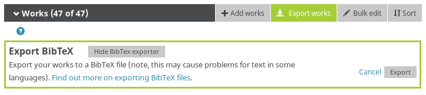

# ARC Friend

For my ARC DECRA application I wanted a list of citations, including citations, journal impact factor, and AltMetrics score.

This script parses the file generated by the ORCID export function, then uses public APIs to get Altmetric, journal impact factor (TODO), and citations.


## Dependencies

Only bibtexparser (`pip3 install bibtexparser`). I have not tested this script under Python 2.x.

## Usage:

First, export your ORCID profile using the button at https://orcid.org/my-orcid:



Then, move the exported works.bib into the current directory and run this:

    python parseBibAndMakeTable.py

That will print the final table to standard out.

Alternatively, you can specify the path:

    python parseBibAndMakeTable.py --file /home/potato/Downloads/otherworks.bib

assumes that you renamed your ORCID export to otherworks.bib.


Example output:

```
1. Mousavi-Derazmahalleh, M., Bayer, P.E., Hane, J.K., Babu, V., Nguyen, H.T., Nelson, M.N., Erskine, W., Varshney, R.K., Papa, R., Edwards, D., 2019. Adapting legume crops to climate change using genomic approaches. Plant, Cell and Environment., 42, 6--19.
Impact Factor = FILLME
Citations = 175
Altmetric score = 9.556
```
